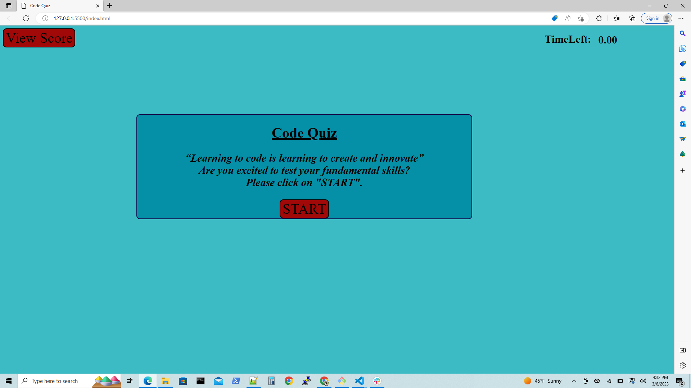

# Code Quiz

## Description
 
1. When user click on start button the code quiz will started.

2. While clicking on start button simultaneously timer was invoked, and started counting from 60 sec.

3. After clicking on start button first question for the code quiz will also appeared.

4. Whenever user click on question's answer. If the question was right  then "Right" message will displayed in right top corner of web page and if the answer was wrong then "Wrong" message will displayed in right top corner of web page in this way evaluation was done during the user solving the quiz.

5. After click on question's answer the user was also redirected to the another question. The another question was displayed.

6. If the timer will passed "0 sec". Then the timer was stopped and the user's code quiz score was displayed.

7. After completed code quiz, the user could also save their final score, by adding their initials and clicking on submit button.

8. If the user want to see high score then the high  score among the students will displayed and the high score will displayed in sorted order.

9. User can also restart the code quiz by clicking "Start Again" button.

## URLs:-
Here, you can find the webpage.

Code Quiz web application's URL:- https://anujalawankar.github.io/assignment-module-4/

Here, you can find the GitHub URL:-
GitHub URL:- https://github.com/AnujaLawankar/assignment-module-4

## Installation

N/A

## Usage

N/A

## Credits

N/A

## License

N/A

## Assets

The following image demonstrates the website appearance:
1. To start a code quiz user have to click on start button.

2. Code quiz is started.

3. The evaluation message will displayed on right top most coner of the web page.

4.User can enter initials to save to score.

5. High score will displayed among the users.

